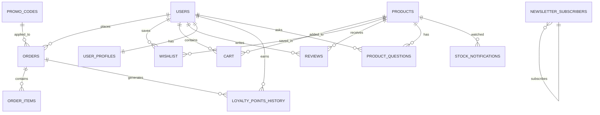

<p align="center">
  
</p>

<h1 align="center">
  <br>
  
  <br>
  A E T H E R
  <br>
</h1>

<h3 align="center">✦ Curated Luxury. Delivered with Intent. ✦</h3>

<p align="center">
  <em>A premium, full-stack e-commerce marketplace built with React, TypeScript, Supabase, and Framer Motion — designed to redefine the online luxury shopping experience.</em>
</p>

<p align="center">
  
  
  
  
  
  
  
</p>

<p align="center">
  <a href="#-features">Features</a> •
  <a href="#-tech-stack">Tech Stack</a> •
  <a href="#-architecture">Architecture</a> •
  <a href="#-getting-started">Getting Started</a> •
  <a href="#-database-schema">Database</a> •
  <a href="#-api-endpoints">API</a> •
  <a href="#-deployment">Deployment</a> •
  <a href="#-contributing">Contributing</a>
</p>

---

## 🌌 Overview

**AETHER** is not just another e-commerce template — it's a meticulously crafted luxury marketplace that pushes the boundaries of what a modern web storefront can be. Every pixel, animation, and interaction has been designed to evoke the feeling of walking into a high-end boutique.

From the immersive full-screen hero with floating product imagery, through cinematic scroll animations, to the satisfying confetti burst on successful checkout — AETHER delivers a shopping experience that customers won't forget.

---

## ✨ Features

### 🛍️ Shopping Experience
| Feature | Description |
|---------|-------------|
| **Immersive Hero** | Full-viewport hero with radial dot pattern, floating product animations, and cinematic Framer Motion entrance |
| **Smart Search** | Real-time search with debounced queries, product previews, and recent search history |
| **Command Palette** | `Ctrl/⌘ + K` spotlight search — navigate anywhere instantly |
| **Quick View Modal** | Preview product details without leaving the page |
| **AR Try-On** | Augmented reality modal for virtual product try-on experience |
| **Product Comparison** | Side-by-side product comparison with a sticky comparison bar |
| **Flash Deals** | Live countdown timers for limited-time offers |
| **Dynamic Filters** | Filter by category, price, rating, availability, and more |

### 🛒 Cart & Checkout
| Feature | Description |
|---------|-------------|
| **Slide-out Cart Drawer** | Elegant side drawer with real-time totals and quantity selectors |
| **Promo Codes** | Full promo engine — percentage, fixed, and free shipping discounts |
| **Gift Wrapping** | Optional gift wrap with custom message at checkout |
| **Multi-currency** | Automatic currency conversion and display |
| **Order Tracking** | Real-time timeline-based order status tracking |
| **Confetti Celebration** | 🎉 Canvas confetti animation on successful order placement |

### 👤 User Experience
| Feature | Description |
|---------|-------------|
| **Auth System** | Email/password + Google OAuth via Supabase Auth |
| **User Dashboard** | Order history, wishlist management, loyalty points, and profile settings |
| **Loyalty Program** | Earn and track loyalty points on every purchase |
| **Wishlist** | Save favorite items with price drop alert toggles |
| **Product Q&A** | Ask questions and view community answers on product pages |
| **Reviews & Ratings** | Star ratings with verified purchase badges |
| **Newsletter** | Email subscription for exclusive drops and offers |

### 🎨 Design & UX
| Feature | Description |
|---------|-------------|
| **Dark Mode First** | Stunning obsidian-black design with purple accent system |
| **Glassmorphism UI** | Frosted glass navbar, modals, and card overlays |
| **Framer Motion** | Silky smooth page transitions, card hovers, scroll reveals |
| **Custom Accent Colors** | User-selectable accent color themes |
| **Responsive Design** | Pixel-perfect across mobile, tablet, and desktop |
| **Accessibility** | Skip links, `focus-visible` outlines, screen reader support, reduced motion |
| **Offline Banner** | Graceful network status detection and notification |
| **Pull-to-Refresh** | Mobile-native refresh gesture support |
| **Lazy Loading** | Intersection Observer-based image and component loading |

---

## 🛠 Tech Stack

```
┌─────────────────────────────────────────────────────────┐
│                     F R O N T E N D                     │
├─────────────┬───────────────────────────────────────────┤
│ Framework   │ React 19 + TypeScript 5.9                 │
│ Build Tool  │ Vite 7 (lightning-fast HMR)               │
│ Styling     │ TailwindCSS 4 + Custom CSS Variables      │
│ Animations  │ Framer Motion 12                          │
│ Routing     │ React Router DOM 7                        │
│ State       │ Zustand 5 (lightweight global state)      │
│ Forms       │ React Hook Form + Zod validation          │
│ Icons       │ Lucide React                              │
│ Toasts      │ Sonner (beautiful toast notifications)    │
│ Typography  │ Inter + Playfair Display + JetBrains Mono │
│ Effects     │ Canvas Confetti                           │
├─────────────┴───────────────────────────────────────────┤
│                     B A C K E N D                       │
├─────────────┬───────────────────────────────────────────┤
│ Database    │ Supabase (PostgreSQL)                     │
│ Auth        │ Supabase Auth + Google OAuth              │
│ API         │ Vercel Serverless Functions               │
│ Storage     │ Supabase Storage (product images)         │
│ Security    │ Row Level Security (RLS) policies         │
├─────────────┴───────────────────────────────────────────┤
│                    D E P L O Y                          │
├─────────────┬───────────────────────────────────────────┤
│ Hosting     │ Vercel (Edge Network)                     │
│ CI/CD       │ Vercel Git Integration                    │
└─────────────┴───────────────────────────────────────────┘
```

---

## 📐 Architecture

```
AETHER/
├── api/                          # Vercel Serverless API Routes
│   ├── cart.js                   # Cart CRUD operations
│   ├── categories.js             # Category listings
│   ├── engagement.js             # User engagement tracking
│   ├── orders.js                 # Order management
│   ├── order_detail.js           # Individual order details
│   ├── products.js               # Product catalog API
│   ├── product_questions.js      # Q&A system
│   ├── reviews.js                # Product reviews
│   ├── user.js                   # User profile operations
│   └── wishlist.js               # Wishlist management
│
├── src/
│   ├── components/               # 31 Reusable UI Components
│   │   ├── Navbar.tsx            # Glassmorphism navigation bar
│   │   ├── ProductCard.tsx       # Animated product cards
│   │   ├── CartDrawer.tsx        # Slide-out cart panel
│   │   ├── CommandPalette.tsx    # ⌘K spotlight search
│   │   ├── QuickViewModal.tsx    # Product quick preview
│   │   ├── ARTryOnModal.tsx      # AR experience modal
│   │   ├── ComparisonBar.tsx     # Product comparison toolbar
│   │   ├── FlashDeals.tsx        # Countdown deal section
│   │   ├── MegaMenu.tsx          # Rich category mega menu
│   │   ├── SearchBar.tsx         # Instant search with preview
│   │   ├── SEO.tsx               # Dynamic meta tag management
│   │   └── ...                   # 20+ more components
│   │
│   ├── pages/                    # Application Pages
│   │   ├── Home.tsx              # Landing page with hero
│   │   ├── ProductDetail.tsx     # Full product page (21KB)
│   │   ├── Cart.tsx              # Shopping cart page
│   │   ├── Checkout.tsx          # Multi-step checkout flow
│   │   ├── Dashboard.tsx         # User dashboard (22KB)
│   │   ├── CategoryPage.tsx      # Category browsing
│   │   ├── ComparePage.tsx       # Product comparison view
│   │   └── NotFound.tsx          # Custom 404 page
│   │
│   ├── stores/                   # Zustand State Management
│   │   ├── useAuth.ts            # Authentication state
│   │   ├── useCart.ts            # Shopping cart state
│   │   ├── useWishlist.ts        # Wishlist state
│   │   ├── useComparison.ts      # Product comparison state
│   │   ├── useCurrency.ts        # Multi-currency support
│   │   ├── useLoyaltyPoints.ts   # Loyalty program state
│   │   └── useUI.ts              # Theme & UI preferences
│   │
│   ├── hooks/                    # Custom React Hooks
│   │   ├── useLazyLoad.tsx       # Intersection Observer loading
│   │   ├── useNetworkStatus.tsx  # Online/offline detection
│   │   └── usePullToRefresh.tsx  # Mobile pull-to-refresh
│   │
│   ├── contexts/                 # React Context Providers
│   │   └── ThemeContext.tsx       # Theme provider
│   │
│   ├── lib/                      # Utility Libraries
│   │   ├── supabase.ts           # Supabase client init
│   │   ├── googleAuth.ts         # Google OAuth helpers
│   │   └── fetchWithRetry.ts     # Resilient API fetching
│   │
│   ├── App.tsx                   # Root application component
│   ├── main.tsx                  # Entry point
│   └── index.css                 # Global styles & design tokens
│
├── public/                       # Static Assets
│   └── favicon.svg               # AETHER brand favicon
│
├── supabase_schema.sql           # Database schema & RLS policies
├── supabase_products_seed.sql    # Product seed data (25-48)
├── vercel.json                   # Vercel deployment config
├── vite.config.ts                # Vite build configuration
├── tsconfig.json                 # TypeScript configuration
└── package.json                  # Dependencies & scripts
```

---

## 🚀 Getting Started

### Prerequisites

| Tool | Version | Purpose |
|------|---------|---------|
| **Node.js** | ≥ 18.x | JavaScript runtime |
| **npm** | ≥ 9.x | Package manager |
| **Supabase Account** | Free tier works | Backend & database |
| **Git** | Latest | Version control |

### 1. Clone the Repository

```bash
git clone https://github.com/orkhankasumov4-netizen/aethere-store.git
cd aethere-store
```

### 2. Install Dependencies

```bash
npm install
```

### 3. Configure Environment

```bash
cp .env.example .env
```

Edit `.env` with your credentials:

```env
# Supabase Configuration
VITE_SUPABASE_URL=https://your-project.supabase.co
VITE_SUPABASE_ANON_KEY=your-anon-key

# Google OAuth (optional)
VITE_GOOGLE_CLIENT_ID=your-google-client-id
VITE_GOOGLE_AUTH_PROXY=https://your-project.supabase.co/auth/v1/callback

# Server-side (Vercel Functions)
NEXT_PUBLIC_SUPABASE_URL=https://your-project.supabase.co
SUPABASE_SERVICE_ROLE_KEY=your-service-role-key
```

### 4. Set Up Database

Execute the SQL schema in your Supabase SQL Editor:

```bash
# Copy contents of these files and run in Supabase SQL Editor:
# 1. supabase_schema.sql        → Creates tables, RLS policies, triggers
# 2. supabase_products_seed.sql → Seeds product catalog data
```

### 5. Start Development Server

```bash
npm run dev
```

Open [http://localhost:5173](http://localhost:5173) and experience AETHER ✨

---

## 🗄️ Database Schema

AETHER uses **Supabase (PostgreSQL)** with full **Row Level Security** enabled.



### Core Tables

| Table | Purpose | RLS |
|-------|---------|-----|
| `products` | Product catalog with pricing, images, variants | Public read |
| `orders` | Order records with tracking, gift wrap, promo codes | User-scoped |
| `cart` | Shopping cart items per user | User-scoped |
| `wishlist` | Saved products with price alert toggles | User-scoped |
| `reviews` | Product ratings and review text | Public read, auth write |
| `user_profiles` | Extended user data and loyalty points | User-scoped |
| `promo_codes` | Discount codes (%, fixed, shipping) | Public read |
| `product_questions` | Q&A on product pages | Public read, auth write |
| `stock_notifications` | Back-in-stock email alerts | Email-scoped |
| `newsletter_subscribers` | Newsletter email list | Public insert |
| `loyalty_points_history` | Points earned/spent log | User-scoped |

---

## 🔌 API Endpoints

All API routes are Vercel Serverless Functions located in `/api/`.

| Method | Endpoint | Description |
|--------|----------|-------------|
| `GET` | `/api/products` | List products (supports `?limit=`, `?category=`, `?search=`) |
| `GET` | `/api/categories` | List all product categories |
| `GET/POST` | `/api/cart` | Get cart items / Add to cart |
| `DELETE` | `/api/cart` | Remove item from cart |
| `POST` | `/api/orders` | Create a new order |
| `GET` | `/api/orders` | Get user's order history |
| `GET` | `/api/order_detail` | Get specific order details |
| `GET/POST` | `/api/reviews` | Get/create product reviews |
| `GET/POST` | `/api/product_questions` | Get/create Q&A entries |
| `GET/POST` | `/api/wishlist` | Get/toggle wishlist items |
| `GET/PATCH` | `/api/user` | Get/update user profile |
| `POST` | `/api/engagement` | Track user engagement events |

---

## 🎨 Design System

AETHER follows a premium dark-first design language:

```css
/* Color Palette */
--aether-bg-primary:    #0A0A0A     /* Deep obsidian black    */
--aether-bg-secondary:  #141414     /* Card backgrounds       */
--aether-bg-tertiary:   #1E1E1E     /* Elevated surfaces      */
--aether-accent:        #7C3AED     /* Royal purple           */
--aether-accent-hover:  #A855F7     /* Purple highlight       */
--aether-success:       #10B981     /* Emerald green          */
--aether-warning:       #F59E0B     /* Amber                  */
--aether-error:         #F43F5E     /* Rose red               */

/* Typography */
Body:     Inter (400, 500, 600, 700)
Headings: Playfair Display (serif elegance)
Code:     JetBrains Mono

/* Effects */
Glass:    rgba(20, 20, 20, 0.85) + backdrop-filter: blur(20px)
Shadow:   0 25px 50px -12px rgba(0, 0, 0, 0.5)
Motion:   cubic-bezier(0.23, 1, 0.32, 1) — Apple-style easing
```

---

## 🌐 Deployment

### Vercel (Recommended)

1. Push your code to GitHub
2. Import the repository on [vercel.com](https://vercel.com)
3. Add environment variables in Vercel dashboard
4. Deploy — Vercel auto-detects Vite and configures everything

```json
// vercel.json is pre-configured:
{
  "buildCommand": "npm run build",
  "outputDirectory": "dist",
  "framework": "vite"
}
```

### Manual Build

```bash
npm run build     # Outputs to ./dist
npm run preview   # Preview production build locally
```

---

## 📜 Available Scripts

| Command | Description |
|---------|-------------|
| `npm run dev` | Start development server with HMR |
| `npm run build` | TypeScript check + Vite production build |
| `npm run preview` | Preview production build locally |
| `npm run lint` | Run ESLint across the codebase |

---

## 🗂 Key Keyboard Shortcuts

| Shortcut | Action |
|----------|--------|
| `⌘/Ctrl + K` | Open Command Palette |
| `Escape` | Close modals and drawers |
| `Tab` | Navigate focusable elements |

---

## 🔒 Security

- **Row Level Security (RLS)** enabled on all Supabase tables
- **Environment variables** — all secrets stored server-side
- **Supabase Auth** handles session management and JWT tokens
- **Input validation** with Zod schemas on critical forms
- **CORS** configured for production domains
- **Fetch with retry** — resilient API calls with exponential backoff

---

## 🤝 Contributing

Contributions are welcome! Here's how to get involved:

1. **Fork** the repository
2. **Create** a feature branch: `git checkout -b feature/amazing-feature`
3. **Commit** your changes: `git commit -m 'Add amazing feature'`
4. **Push** to the branch: `git push origin feature/amazing-feature`
5. **Open** a Pull Request

### Development Guidelines

- Follow existing code style and TypeScript conventions
- Use Zustand for global state, React state for local state
- All new routes must include `<SEO />` component
- Animations should respect `prefers-reduced-motion`
- New tables must have RLS policies

---

## 📄 License

This project is proprietary software. All rights reserved.

---

<p align="center">
  <br>
  
  <br><br>
  <strong>AETHER</strong> — Where luxury meets technology.
  <br>
  <sub>Designed & developed by <a href="https://github.com/orkhankasumov4-netizen">@orkhankasumov4-netizen</a></sub>
</p>
